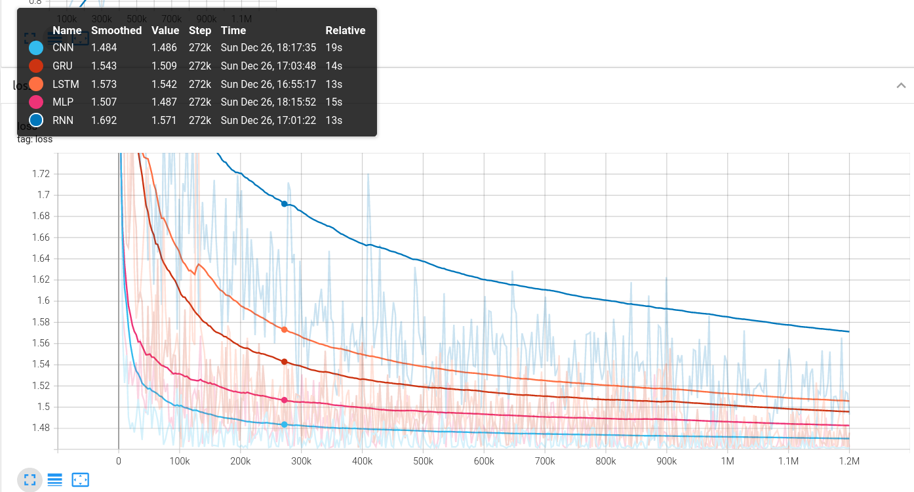

[](https://github.com/lh9171338/Outline) MNIST Classify
===

# 1. Introduction
>>The repository contains five MNIST classification models implemented by PyTorch, which are based on MLP, CNN, RNN, LSTM, and GRU respectively.

# 2. Results

| Model | #FLOPs (K) | #Params (K) | Acc (%) |
| :---: | :---: | :---: | :---: |
| RNN | 333.8 | 6.5 | 94.4 |
| LSTM | 1345.2 | 24.1 | 98.5 |
| RGU | 1012.8 | 18.3 | 98.9 |
| MLP | 475.1 | 238.0 | 98.7 |
| CNN | 577.1 | 43.8 | 99.3 |

<p align="center">
    
</p> 
<p align="center">
    
</p> 

# 3. Requirements

 - python3
 - pytorch==1.6.0
 - CUDA==10.1
 - argparse, yacs, tqdm, tensorboardX

# 4. Training & Testing

## Training
```shell
python train.py --model_name <MODEL_NAME> [--gpu <GPU_ID>]
```

## Test
```shell
python test.py --model_name <MODEL_NAME> [--gpu <GPU_ID>]
```
