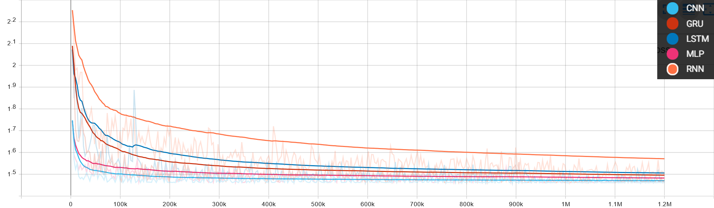
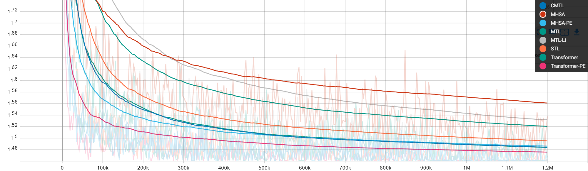
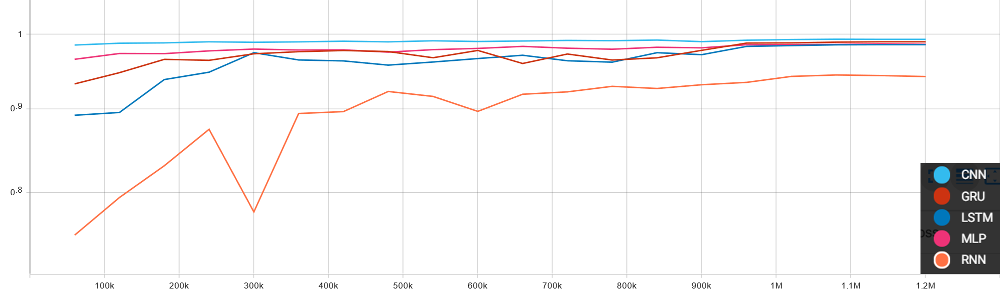
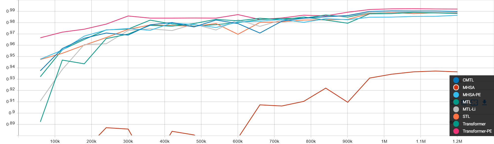

[](https://github.com/lh9171338/Outline) MNIST Classify
===

# Introduction
The repository contains the PyTorch implementation of image classification models for MNIST dataset, based on MLP, CNN, RNN, LSTM, GRU, and Transformer.

# Results

## Metrics
| Model | #FLOPs (M) | #Params (K) | Acc (%) |
| :--- | :---: | :---: | :---: |
| RNN | 0.3 | 6.5 | 94.4 |
| LSTM | 1.3 | 24.1 | 98.5 |
| GRU | 1.0 | 18.3 | 98.9 |
| MLP | 0.5 | 238.0 | 98.7 |
| CNN | 0.6 | 43.8 | 99.3 |
| MHSA | 5.9 | 27.9 | 93.7 |
| MHSA-PE | 5.9 | 27.9 | 98.7 |
| MTL | 37.4 | 135.1 | 98.9 |
| MTL-Li | 35.1 | 111.1 | 98.9 |
| CMTL | 39.1 | 150.9 | 99.0 |
| STL | 37.0 | 98.0 | 98.8 |
| Transformer | 36.1 | 142.9 | 98.9 |
| Transformer-PE | 36.1 | 142.9 | 99.2 |

## Loss & Accuracy Curves

<p align="center">
    
</p>
<p align="center">
    
</p>
<p align="center">
    
</p>
<p align="center">
    
</p>

# Requirements

 - python3
 - pytorch==1.6.0
 - CUDA==10.1
 - argparse, yacs, tqdm, tensorboardX

# Training & Testing

## Training
```shell
python train.py --arch <ARCH> [--model_name <MODEL_NAME>] [--gpu <GPU_ID>]
```

## Test
```shell
python test.py --arch <ARCH> [--model_name <MODEL_NAME>] [--gpu <GPU_ID>]
```
