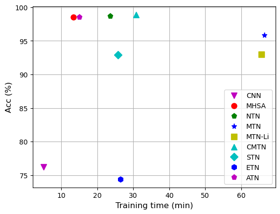
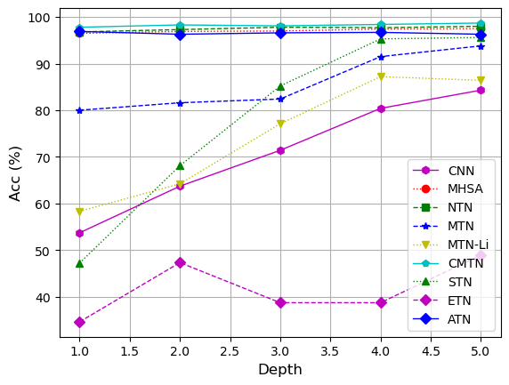

[](https://github.com/lh9171338/Outline) MNIST Classify
===

# Introduction
The repository contains the PyTorch implementation of image classification models for MNIST dataset, based on transformer.

# Results

## Metrics

- **Accuracy (%)**

Training with all training dataset and the **depth** is set to 1.

| Model | #Memory (G) | #Params (M) | #GLOPs (G) | Training time (min) | Acc (%) |
| :--- | :---: | :---: | :---: | :---: | :---: |
| CNN | 0.6 | 25.3 | 9.4 | 5.1 | 76.2 |
| MHSA | 1.4 | 84.3 | 3.6 | 13.3 | 98.5 |
| NTN | 2.5 | 318.9 | 11.2 | 23.6 | 98.7 |
| MTN | 1.7 | 318.9 | 11.1 | 66.5 | 95.8 |
| MTN-Li | 1.7 | 66.9 | 10.3 | 65.7 | 93.0 |
| CMTN | 3.2 | 327.5 | 12.8 | 30.8 | 98.9 |
| STN | 1.7 | 60.3 | 11.3 | 25.7 | 92.9 |
| ETN | 1.8 | 411.4 | 77.7 | 26.4 | 74.4 |
| ATN | 1.5 | 239.0 | 9.0 | 15.0 | 98.5 |

- **Ablation study of depth**
            
All ablation experiments used only one tenth of the training dataset.

| Model | 1 | 2 | 3 | 4 | 5 |
| :--- | :---: | :---: | :---: | :---: | :---: |
| CNN | 53.7 | 63.7 | 71.4 | 80.4 | 84.3 |
| MHSA | 96.5 | 96.9 | 97.0 | 97.4 | 97.5 |
| NTN | 96.8 | 97.3 | 97.8 | 97.7 | 98.0 |
| MTN | 80.0 | 81.6 | 82.4 | 91.5 | 93.8 |
| MTN-Li | 58.3 | 64.2 | 77.1 | 87.2 | 86.4 |
| CMTN | 97.8 | 98.3 | 98.1 | 98.4 | 98.7 |
| STN | 47.2 | 68.1 | 85.2 | 95.3 | 95.6 |
| ETN | 34.6 | 47.3 | 38.7 | 38.7 | 48.9 |
| ATN | 96.9 | 96.3 | 96.6 | 96.7 | 96.3 |

- **Ablation study of MHSA**

| Case | PE | LN | Proj | Nh | DW | Acc (%) |
| :---: | :---: | :---: | :---: | :---: | :---: | :---: |
| (a) | √ | √ | √ | 8 | - | 97.6 |
| (b) | - | √ | √ | 8 | - | 93.8 |
| (c) | √ | - | √ | 8 | - | 97.1 |
| (d) | √ | √ | - | 8 | - | 96.4 |
| (e) | √ | √ | - | 4 | - | 96.5 |
| (f) | √ | √ | - | 2 | - | 95.8 |
| (g) | √ | √ | - | 1 | - | 93.3 |
| (h) | √ | √ | - | 8 | √ | 97.5 |

- **Ablation study of NTN**

| Case | PE | Attn | FFN | LN | Acc (%) |
| :---: | :---: | :---: | :---: | :---: | :---: |
| (a) | √ | √ | √ | √ | 97.4 |
| (b) | - | √ | √ | √ | 92.0 |
| (c) | - | - | √ | √ | 46.5 |
| (d) | √ | √ | - | √ | 97.6 |
| (e) | √ | √ | √ | - | 89.9 |

- **Ablation study of STN**

| Case | FFN | LN | mlp_ratio | Acc (%) |
| :---: | :---: | :---: | :---: | :---: |
| (a) | √ | √ | 4 | 77.6 |
| (b) | - | √ | 4 | 70.6 |
| (c) | √ | - | 4 | 58.7 |
| (d) | √ | √ | 2 | 78.0 |
| (e) | √ | √ | 1 | 74.9 |

- **Ablation study of MTN**

| Case | Linear | Attn | FFN | LN | Acc (%) |
| :---: | :---: | :---: | :---: | :---: | :---: |
| (a) | - | √ | √ | √ | 89.7 |
| (b) | √ | √ | √ | √ | 62.1 |
| (c) | - | - | √ | √ | 49.5 |
| (d) | - | √ | - | √ | 89.5 |
| (e) | - | √ | √ | - | 52.3 |

## Accuracy Curves

<p align="center">
    
    
</p>

# Requirements

 - python3
 - pytorch==1.6.0
 - CUDA==10.1
 - argparse, yacs, tqdm, tensorboardX, timm

# Training & Testing

## Training
```shell
python train.py --arch <ARCH> --pos_encoding [--depth <DEPTH>] [--model_name <MODEL_NAME>] [--gpu <GPU_ID>]
# or python train.py -a <ARCH> -p [-d <DEPTH>] [-m <MODEL_NAME>] [-g <GPU_ID>]
```

## Test
```shell
python test.py --arch <ARCH> --pos_encoding [--depth <DEPTH>] [--model_name <MODEL_NAME>] [--gpu <GPU_ID>]
# or python test.py -a <ARCH> -p [-d <DEPTH>] [-m <MODEL_NAME>] [-g <GPU_ID>]
```
